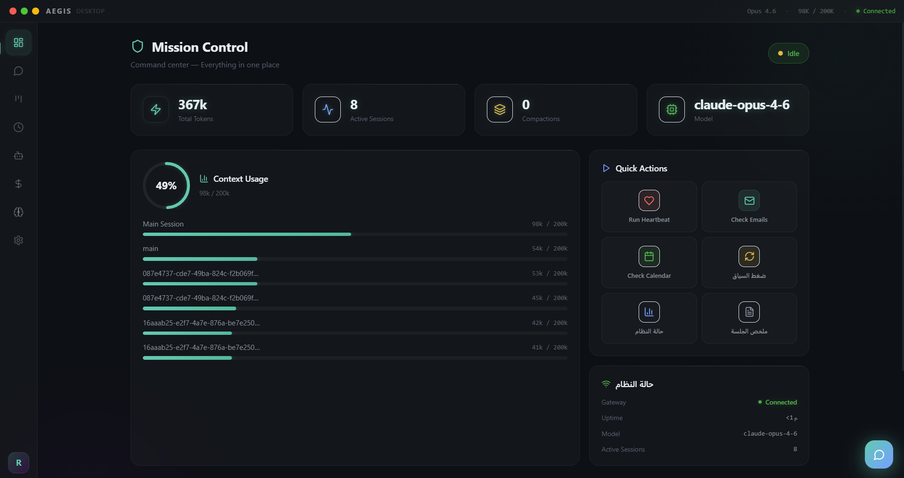
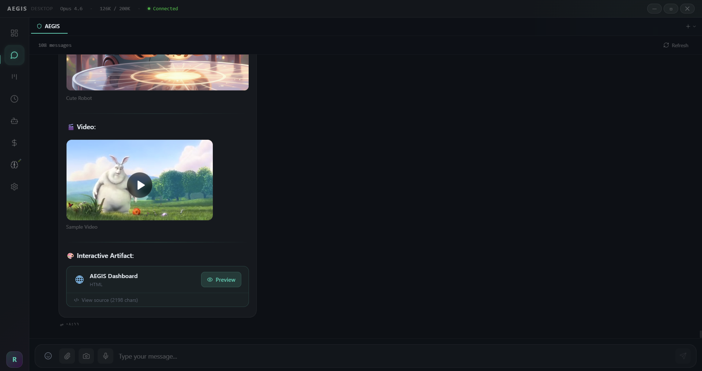
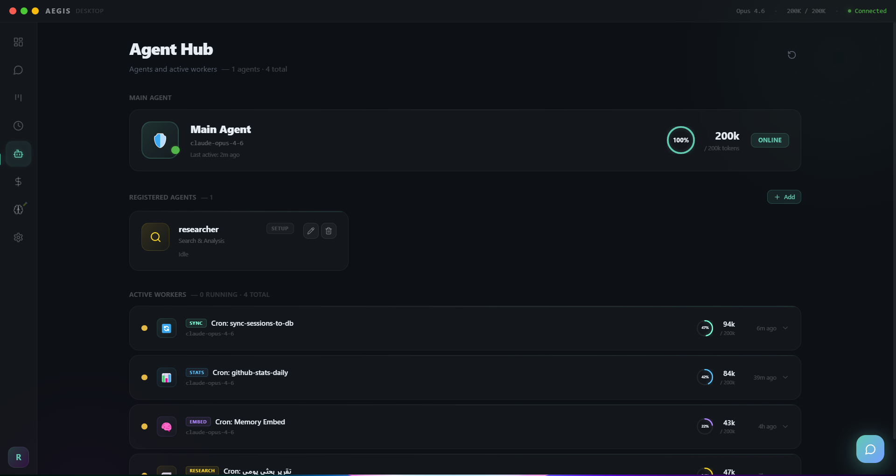
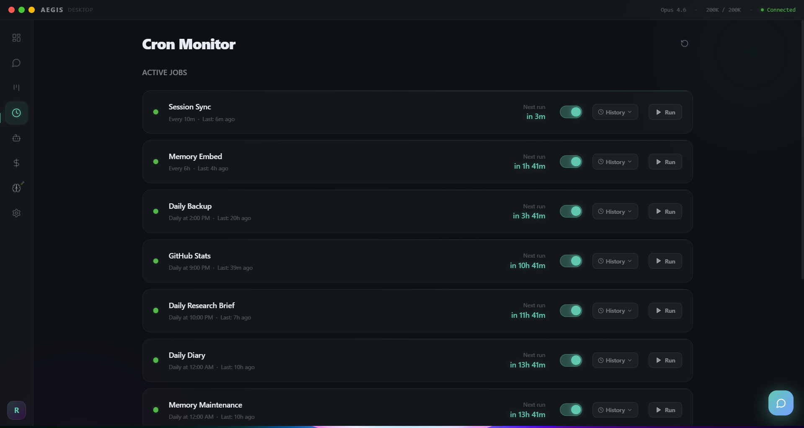
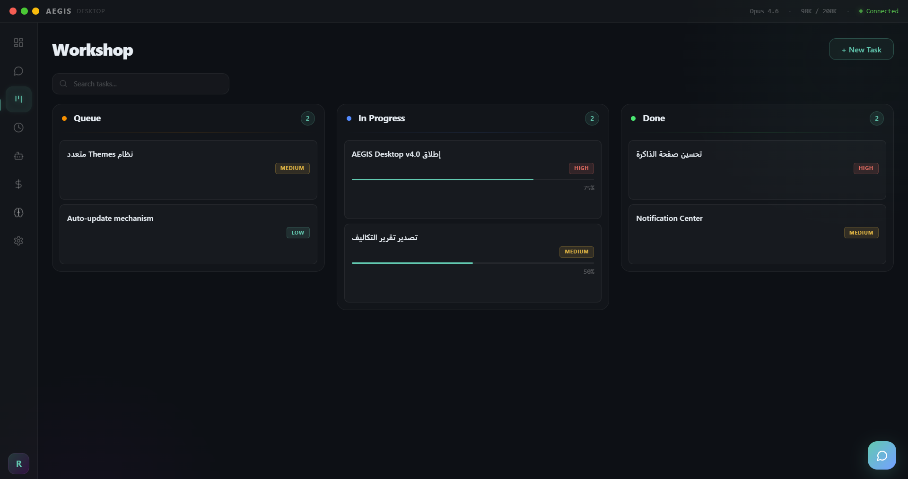
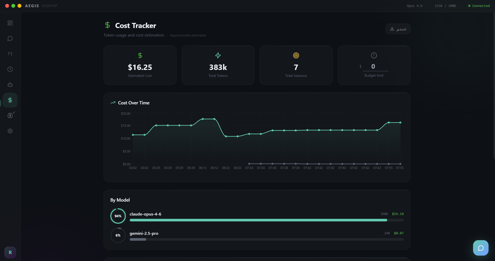
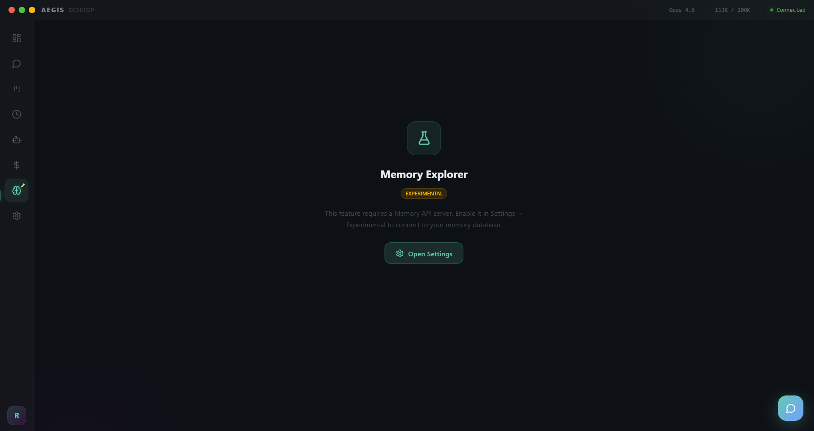

# 🛡️ AEGIS Desktop v5.0 — Mission Control

> **Advanced Executive General Intelligence System** — Your AI Command Center


A premium desktop client for [OpenClaw](https://github.com/openclaw/openclaw) — transforming your AI gateway into a full mission control center with 8 dedicated pages, real-time monitoring, and multi-agent management.

---

## 📸 Screenshots

| Dashboard | Chat |
|:---------:|:----:|
|  |  |

| Agent Hub | Cron Monitor |
|:---------:|:------------:|
|  |  |

| Workshop (Kanban) | Cost Tracker |
|:-----------------:|:------------:|
|  |  |

| Memory Explorer |
|:---------------:|
|  |

### 🎬 Video Demos

- [Chat — streaming, images, video, artifacts](screenshots/chat.mp4)
- [Settings — language switch, RTL/LTR](screenshots/settings.mp4)

---

## ✨ Features

### 🏠 Dashboard — Mission Control
- At-a-glance overview: connection status, token usage, active sessions
- Quick Actions — trigger heartbeat, check email, view calendar, compact context
- Health monitor — gateway status, uptime, model info
- Sparkline charts for token and session trends

### 💬 Chat
- **Multi-tab sessions** — open multiple chats with `Ctrl+Tab` switching
- **Streaming responses** with real-time markdown rendering
- **Image support** — paste, drag & drop, or upload images (inline base64)
- **Video playback** — video URLs render as inline players with controls
- **File attachments** — non-image files sent as paths for the agent to read
- **User message markdown** — tables, code blocks, and formatting in user messages too
- **Emoji Picker** with search, categories, and direction-aware positioning
- **Voice playback** — TTS audio via Edge TTS or other providers
- **Floating Chat Widget** (Intercom-style) — available on every page
- **Compaction Divider** — visual separator when context is compressed
- **Message Queue** — messages buffer during disconnect and auto-send on reconnect

### 🎨 Artifacts Preview
- **Separate preview window** for interactive content
- **HTML** — full pages with inline CSS/JS
- **React** — JSX support via Babel standalone (React 18 pre-loaded)
- **SVG** — raw SVG markup rendering
- **Mermaid** — diagram syntax rendering
- Sandboxed iframe for security — CDN scripts allowed via CSP

### 🤖 Agent Hub
- **Main Agent** hero card with live status
- **Registered Agents** grid — view all configured agents
- **Agent CRUD** — create, edit, and delete agents directly from the UI
- **Active Workers** — monitor isolated sessions (cron jobs, sub-agents)
- **Smart Classification** — 10 worker types with auto-detected icons and colors

### ⏰ Cron Monitor
- **Job Dashboard** — view all scheduled jobs with status, schedule, and controls
- **Run / Pause / Resume** — manage jobs with one click
- **Run History** — expandable view showing last 10 runs per job
- **Human-readable schedules** — "Every 6h", "Daily at 9:00 PM"
- **Templates** — 4 ready-made templates (Morning Briefing, Weekly Digest, Check-In, System Health)

### 📋 Workshop (Kanban)
- **Drag & Drop** task board with Queue / In Progress / Done columns
- **Task cards** with priority badges, descriptions, and agent assignments
- **Agent commands** — any model can manage tasks via `[[workshop:add/move/delete/progress/list]]`

### 💰 Cost Tracker
- **Usage charts** — cost over time by model (Recharts area chart)
- **Budget Alerts** — warnings when approaching or exceeding limits
- **Model breakdown** — tokens and cost per model with progress rings
- **Export** — CSV download or copy summary to clipboard

### 🧠 Memory Explorer
- **Two modes** — connect to a Memory API server or browse local `.md` files
- **Semantic search** (API mode) or text search (local mode)
- **Color-coded categories** — visual bars and badges by memory type
- **CRUD operations** — create, edit, and delete memories

### 🔔 Notification Center
- **Bell badge** with unread count
- **Notification history** panel
- **Chime sound** + Do Not Disturb mode

### ⌨️ Keyboard Shortcuts

| Shortcut | Action |
|----------|--------|
| `Ctrl+K` | Command Palette |
| `Ctrl+1` – `Ctrl+8` | Navigate to page |
| `Ctrl+,` | Open Settings |
| `Ctrl+Tab` | Switch chat tabs |
| `Ctrl+W` | Close current tab |
| `Ctrl+N` | Go to Chat |
| `Ctrl+R` | Refresh |
| `Alt+Space` | Show/hide window (global) |

### 🌐 Multi-Language (Full RTL/LTR)
- **Arabic (العربية)** — full RTL layout
- **English** — full LTR layout
- All pages use logical CSS properties (`ms-`, `me-`, `text-start`, `text-end`) for correct bidirectional rendering
- Switch anytime from Settings

### 🔐 Security
- **Ed25519 Device Identity** — auto-generated keypair for gateway authentication
- **Challenge-response handshake** — secure WebSocket connection
- **Sandboxed artifact preview** — CSP-protected iframe
- **No hardcoded credentials** — token saved locally via IPC

### 🎨 Design
- **Liquid Glass Dark** theme with Electric Blue accents
- **Glass Pill** window controls (custom title bar)
- **Framer Motion** animations throughout
- **Splash Screen** on startup

### 🔌 Connection
- **Auto-reconnect** with exponential backoff
- **Activity-based heartbeat** — detects dead connections within 45s
- **Offline message queue** — buffers messages, auto-flushes on reconnect
- **Token usage bar** in title bar — always visible

---

## 🆕 What's New in v5.0

### New Features
- **Artifacts Preview** — interactive HTML, React (JSX/Babel), SVG, and Mermaid in a separate window
- **Video support** — video URLs render inline with play/pause/fullscreen/save controls
- **Workshop Commands** — agents can manage Kanban tasks via text commands
- **Device Identity** — Ed25519 keypair for secure gateway authentication
- **Memory Explorer** — now supports local `.md` files (no API server required)
- **User message markdown** — tables, code blocks, and formatting rendered for user messages too

### Fixes
- **Screenshot** — PowerShell `CopyFromScreen` method (fixes DXGI failures on some Windows setups)
- **File sending** — non-image files now send path instead of base64 (lighter messages)
- **Emoji Picker** — direction-aware positioning (opens correctly in both LTR and RTL)
- **Image display** — fixed DOM nesting error (`<div>` inside `<p>`)
- **RTL/LTR overhaul** — all 14+ pages now use logical CSS properties for correct bidirectional layout
- **OpenClaw compatibility** — updated WebSocket handshake for latest gateway protocol

---

## 📦 Installation

1. Download `AEGIS-Desktop-Setup-5.0.0.exe` from [Releases](../../releases)
2. Run the installer — choose your language (Arabic / English)
3. Make sure [OpenClaw](https://github.com/openclaw/openclaw) Gateway is running
4. On first launch, pair with your gateway (one-time setup)

### Portable

Download `AEGIS-Desktop-5.0.0.exe` — runs without installation.

### Requirements

- Windows 10/11
- [OpenClaw](https://github.com/openclaw/openclaw) v2026.2.14 or later
- OpenClaw Gateway running locally or remotely

---

## 🛠️ Development

```bash
npm install
npm run dev            # Vite + Electron (hot reload)
npm run dev:web        # Vite only (browser, no Electron)
npm run build          # Production build
npm run package        # NSIS Installer
npm run package:portable  # Portable exe
```

---

## 🔧 Tech Stack

| Layer | Technology |
|-------|-----------|
| Framework | Electron 34 |
| UI | React 18 + TypeScript 5.7 |
| Build | Vite 6 |
| Styling | TailwindCSS + Framer Motion |
| State | Zustand (persisted) |
| Charts | Recharts |
| i18n | react-i18next |
| Routing | react-router-dom |
| Icons | Lucide React |
| Security | Ed25519 (Node.js crypto) |

---

## 👤 Author

**Rashed** — © 2026
