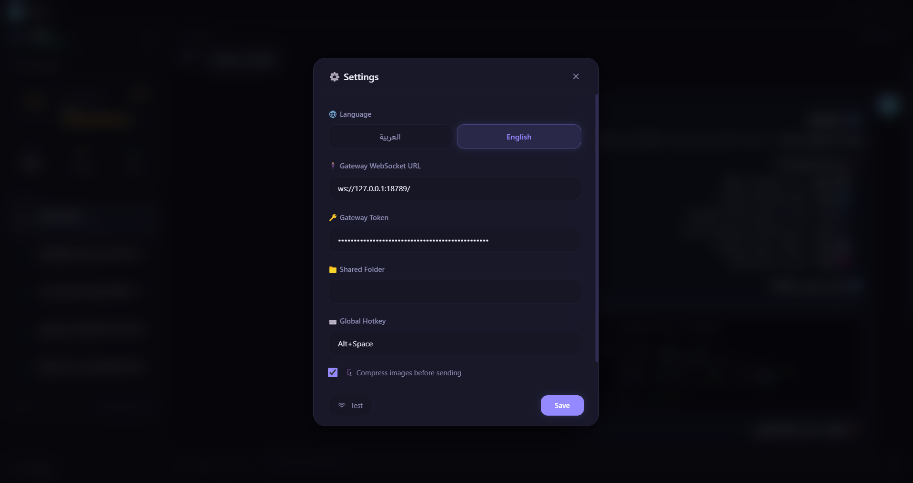

# 🛡️ AEGIS Desktop

**Advanced Executive General Intelligence System — Desktop Client**

A premium native Windows desktop client for [OpenClaw](https://github.com/openclaw/openclaw) Gateway, built with Electron + React + TypeScript.


---

## 📸 Screenshots

### Arabic Interface (RTL)


### English Interface (LTR)


### Settings (Arabic)


### Settings (English)


---

## ✨ Features

### 💬 Chat
- Real-time messaging with OpenClaw Gateway via WebSocket
- Markdown rendering with syntax-highlighted code blocks
- Streaming responses with typing indicator
- Auto-load chat history on connect
- Message copy & resend

### 🎨 Premium Dark UI
- Glass-morphism design with backdrop blur
- Custom color system with glow effects
- Smooth animations and transitions
- Responsive layout

### 📊 Token Usage Dashboard
- Inline sidebar dashboard — no modal needed
- Circular progress ring with percentage
- Per-session token breakdown
- Real-time updates after each response

### 🌐 Multi-Language (i18n)
- **Arabic** (RTL) — full right-to-left support
- **English** (LTR) — full left-to-right support
- Language selection during installation (NSIS)
- Switch anytime from Settings
- All UI elements adapt direction automatically

### 🎤 Voice
- Voice recording with audio level visualizer
- Voice message sending via shared folder
- TTS audio playback (Edge TTS integration)
- Custom AudioPlayer component

### 📎 Attachments
- Image upload via file picker
- Screenshot capture (full screen + per-window)
- Clipboard paste (Ctrl+V)
- Drag & drop images
- Image preview with size indicator

### 😊 Emoji Picker
- Full emoji picker with categories
- Search and frequently used
- Native emoji rendering
- Adapts to selected language

### ⚙️ Settings
- Gateway URL & token configuration
- Connection testing
- Shared folder path
- Global hotkey (Alt+Space)
- Image compression toggle
- Auto-start with Windows

### 🖥️ Desktop Features
- Frameless window with custom title bar
- System tray with minimize-to-tray
- Global hotkey to show/hide
- Right-click context menu (Cut/Copy/Paste)
- NSIS installer with language selection

---

## 🛠️ Tech Stack

| Technology | Version | Purpose |
|-----------|---------|---------|
| Electron | 34 | Desktop framework |
| React | 18 | UI framework |
| TypeScript | 5.x | Type safety |
| Vite | 6 | Build tool |
| TailwindCSS | 3.x | Styling |
| Zustand | 5 | State management |
| react-i18next | - | Internationalization |
| react-markdown | - | Markdown rendering |
| emoji-mart | - | Emoji picker |
| lucide-react | - | Icons |

---

## 📦 Installation

### From Installer
Download the latest `AEGIS-Desktop-Setup-x.x.x.exe` from [Releases](https://github.com/rshodoskar-star/openclaw-desktop/releases).

### From Source

```bash
# Clone
git clone https://github.com/rshodoskar-star/openclaw-desktop.git
cd openclaw-desktop

# Install dependencies
npm install

# Development
npm run dev

# Build
npm run build

# Package installer
npm run package
```

---

## ⚙️ Configuration

On first launch, configure in Settings (⚙️):

| Setting | Default | Description |
|---------|---------|-------------|
| Gateway URL | `ws://127.0.0.1:18789` | OpenClaw Gateway WebSocket URL |
| Gateway Token | — | Authentication token |
| Shared Folder | `D:\clawdbot-shared` | Shared folder for voice files |
| Global Hotkey | `Alt+Space` | Show/hide window |

---

## 🏗️ Project Structure

```
aegis-desktop/
├── electron/           # Electron main process
│   ├── main.ts        # Main entry, IPC handlers
│   ├── preload.ts     # Preload bridge (aegis API)
│   ├── gateway.ts     # Gateway WebSocket client
│   └── tray.ts        # System tray
├── src/               # React renderer
│   ├── components/    # UI components
│   │   ├── Chat/      # ChatView, MessageBubble, Input...
│   │   ├── Sidebar/   # Sidebar with token dashboard
│   │   ├── Settings/  # Settings modal
│   │   └── TitleBar   # Custom title bar
│   ├── locales/       # i18n translations (ar, en)
│   ├── services/      # Gateway service
│   ├── stores/        # Zustand stores
│   ├── styles/        # TailwindCSS
│   └── i18n.ts        # i18n configuration
├── installer/         # NSIS installer scripts
├── assets/            # Icons and images
└── package.json
```

---

## 📋 Requirements

- Windows 10/11
- [OpenClaw](https://github.com/openclaw/openclaw) Gateway running locally or remotely
- Node.js 18+ (for development)

---

## 📝 Changelog

### v3.1.0 (2026-02-08)
- 🌐 Multi-language support (Arabic + English) with RTL/LTR
- 😊 Emoji picker
- 📊 Inline token usage dashboard in sidebar
- 🎤 Voice recording & TTS playback
- 🎨 Premium dark theme with lighter palette
- 📷 Screenshot capture (full screen + per-window)
- 🖱️ Right-click context menu
- 🔄 Auto-load chat history on connect
- 📦 NSIS installer with language selection

### v2.0.0 (2026-01-31)
- Gateway WebSocket direct connection
- Screenshot & image sending
- Frameless window with system tray

### v1.0.0 (2026-01-31)
- Initial release — WebCatalog wrapper

---

## 📄 License

MIT

---

**Built with ❤️ by [Rashed](https://github.com/rshodoskar-star)**
