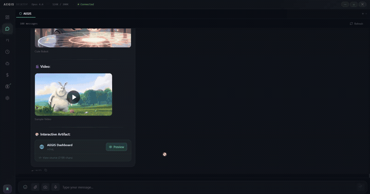

<div align="center">
  
  <h1>AEGIS Desktop</h1>
  <p><strong>Advanced Executive General Intelligence System</strong></p>
  <p>The desktop client that turns your OpenClaw Gateway into a full mission control center.</p>
</div>

---


---

## 🤔 Why AEGIS Desktop?

OpenClaw is powerful — but managing it through a terminal or basic UI leaves a lot on the table. AEGIS Desktop gives it a proper home:

- 💬 **Chat** — streaming responses, artifacts, images, voice, and multi-tab sessions
- 📊 **Analytics** — see exactly what you're spending and where, broken down by model and agent
- 🤖 **Agent Hub** — manage all your agents from a single panel
- ⏰ **Cron Monitor** — schedule and control jobs visually
- 🌍 **Bilingual** — full Arabic (RTL) and English (LTR) support out of the box

If you run OpenClaw, AEGIS Desktop is the UI it deserves.

---

## 📋 Table of Contents

- [Screenshots](#-screenshots)
- [Features](#-features)
- [What's New in v5.1](#-whats-new-in-v51)
- [How It Works](#-how-it-works)
- [Installation](#-installation)
- [Development](#️-development)
- [Tech Stack](#-tech-stack)

---

## 📸 Screenshots

### 💬 Chat


### 🌑 Dark Mode — All Pages


### 🌕 Light Mode — All Pages


---

## ✨ Features

### 🏠 Dashboard — Mission Control (Cost-First Design)
- **Hero Cards** — total cost, tokens, sessions, and active agents at a glance
- **Cost chart** — spending over time with model breakdown
- **Active agents** panel with live status indicators
- **Quick Actions** — heartbeat, email check, calendar, compact context
- **Live sessions** feed with recent activity
- **`Promise.allSettled`** — individual API failures don't break the page

### 💬 Chat
- **Welcome Screen** — AEGIS shield + branding on launch, loads session on first interaction
- **Multi-tab sessions** — open multiple chats with `Ctrl+Tab` switching
- **Streaming responses** with real-time markdown rendering
- **Image support** — paste, drag & drop, or upload images (inline base64)
- **Video playback** — video URLs render as inline players with controls
- **File attachments** — non-image files sent as paths for the agent to read
- **User message markdown** — tables, code blocks, and formatting in user messages
- **Tool Intent View** — collapsible cards showing tool calls with name, params, and result (toggle in Settings)
- **Emoji Picker** with search, categories, and direction-aware positioning
- **Voice playback** — TTS audio via Edge TTS or other providers
- **Floating Chat Widget** (Intercom-style) — available on every page
- **Compaction Divider** — animated shimmer separator when context is compressed
- **Message Queue** — messages buffer during disconnect and auto-send on reconnect
- **Auto Code Detection** — syntax highlighting with `oneLight`/`oneDark` auto-switching based on theme

### 🎨 Artifacts Preview
- **Separate preview window** for interactive content
- **HTML** — full pages with inline CSS/JS
- **React** — JSX support via Babel standalone (React 18 pre-loaded)
- **SVG** — raw SVG markup rendering
- **Mermaid** — diagram syntax rendering
- Sandboxed iframe for security — CDN scripts allowed via CSP

### 📊 Full Analytics
- **17-file analytics suite** replacing the old Cost Tracker
- **Overview cards** — total cost, tokens, sessions with animated counters
- **Cost chart** — area chart by model over time (Recharts)
- **Model breakdown** — tokens and cost per model with progress rings
- **Agent breakdown** — per-agent usage stats
- **Token breakdown** — input/output/cache distribution
- **Daily breakdown table** — sortable rows with cost per day
- **Date Range Picker** — 6 presets + custom range
- **Export** — CSV download or copy summary to clipboard
- **Smart cache** — stale-while-revalidate in localStorage

### 🤖 Agent Hub
- **Main Agent** hero card with live status
- **Registered Agents** grid — view all configured agents
- **Agent CRUD** — create, edit, and delete agents directly from the UI
- **Active Workers** — monitor isolated sessions (cron jobs, sub-agents)
- **Smart Classification** — 10 worker types with auto-detected icons and colors

### ⏰ Cron Monitor
- **Job Dashboard** — view all scheduled jobs with status, schedule, and controls
- **Run / Pause / Resume** — manage jobs with one click
- **Run History** — expandable view showing last 10 runs per job
- **Human-readable schedules** — "Every 6h", "Daily at 9:00 PM"
- **Templates** — 4 ready-made templates (Morning Briefing, Weekly Digest, Check-In, System Health)

### 📋 Workshop (Kanban)
- **Drag & Drop** task board with Queue / In Progress / Done columns
- **Task cards** with priority badges, descriptions, and agent assignments
- **Agent commands** — any model can manage tasks via `[[workshop:add/move/delete/progress/list]]`

### 🧠 Memory Explorer
- **Two modes** — connect to a Memory API server or browse local `.md` files
- **Semantic search** (API mode) or text search (local mode)
- **Color-coded categories** — visual bars and badges by memory type
- **CRUD operations** — create, edit, and delete memories

### 🔔 Notification Center
- **Bell badge** with unread count
- **Notification history** panel
- **Chime sound** + Do Not Disturb mode

### 🎛️ Title Bar Controls
- **Model Picker** — switch models dynamically from the title bar (loaded from gateway config)
- **Thinking Picker** — change reasoning level (off / low / medium / high) on the fly
- **Token usage bar** — always visible context percentage
- **1M Context Toggle** — available in Settings for Anthropic API

### ⌨️ Keyboard Shortcuts

| Shortcut | Action |
|----------|--------|
| `Ctrl+K` | Command Palette |
| `Ctrl+1` – `Ctrl+8` | Navigate to page |
| `Ctrl+,` | Open Settings |
| `Ctrl+Tab` | Switch chat tabs |
| `Ctrl+W` | Close current tab |
| `Ctrl+N` | Go to Chat |
| `Ctrl+R` | Refresh |
| `Alt+Space` | Show/hide window (global) |

### 🌓 Theme System
- **Dark Mode** — deep background with electric blue accents
- **Light Mode** — cool gray background with teal/blue accents
- **CSS Variables** — full token-based system (`--aegis-*`) across all components
- **Theme Utilities** — `themeHex()`, `themeAlpha()`, `overlay()`, `dataColor()` for charts/SVG
- **Data Palette** — 10 distinct colors for charts and graphs, both dark and light variants
- **Code blocks** auto-switch between `oneLight` and `oneDark` syntax themes
- Switch anytime from Settings with instant preview

### 🌐 Multi-Language (Full RTL/LTR)
- **Arabic (العربية)** — full RTL layout
- **English** — full LTR layout
- All pages use logical CSS properties (`ms-`, `me-`, `text-start`, `text-end`)
- Switch anytime from Settings

### 🔐 Security
- **Ed25519 Device Identity** — auto-generated keypair for gateway authentication
- **Challenge-response handshake** — secure WebSocket connection
- **Sandboxed artifact preview** — CSP-protected iframe
- **No hardcoded credentials** — token saved locally via IPC

### 🎨 Design
- **Glass morphism** with blur and transparency effects
- **Glass Pill** window controls (custom title bar)
- **Framer Motion** animations throughout
- **Splash Screen** on startup

### 🔌 Connection
- **Auto-reconnect** with exponential backoff
- **Activity-based heartbeat** — detects dead connections within 45s
- **Offline message queue** — buffers messages, auto-flushes on reconnect

---

## 🆕 What's New in v5.1

### New Features
- **Dashboard rewrite** — cost-first design with hero cards, agent panel, and live sessions feed
- **Full Analytics** — 17-file analytics suite replacing Cost Tracker (date ranges, agent/model/token breakdowns, daily table, export)
- **Model Picker** — switch AI models from the title bar (dynamically loaded from gateway config)
- **Thinking Picker** — change reasoning level (off / low / medium / high) from the title bar
- **Tool Intent View** — see what tools the AI is calling with collapsible cards (toggle in Settings)
- **Light Mode** — complete light theme with custom palette, auto-switching code blocks
- **Theme System** — full CSS variable architecture (`--aegis-*` tokens), zero hardcoded colors
- **Welcome Screen** — AEGIS branding on launch, chat loads only on first interaction
- **1M Context Toggle** — enable extended context window in Settings (Anthropic API)
- **`gateway.call()`** — public RPC method for direct gateway communication

### Fixes & Improvements
- **All hardcoded colors removed** — every component uses theme tokens (dark + light safe)
- **Dashboard resilience** — `Promise.allSettled` prevents single API failure from breaking the page
- **Code blocks** — auto-switch `oneLight`/`oneDark` syntax theme based on app theme
- **Model detection** — exact match (`===`) instead of `includes()` for accurate active model indicator
- **Central Store** — Zustand store with smart polling (10s/30s/120s intervals) and event listening
- **Cost Tracker removed** — fully replaced by Full Analytics at `/costs` and `/analytics`

---

## 🔌 How It Works

AEGIS Desktop is a frontend client — it doesn't store or generate any data on its own. All intelligence, sessions, and history live in your **OpenClaw Gateway**.

### Data Flow

```
OpenClaw Gateway (local or remote)
        │
        │  WebSocket (ws://)
        ▼
  AEGIS Desktop
  ├── Chat       ← sends messages, receives streaming responses
  ├── Dashboard  ← polls sessions, cost, and agent status
  ├── Analytics  ← fetches cost summary and token usage history
  ├── Agent Hub  ← reads and manages registered agents
  ├── Cron       ← lists, runs, pauses, and edits scheduled jobs
  └── Workshop   ← local Kanban board (stored in-app)
```

### Where Data Comes From

| Page | Source |
|------|--------|
| Chat history | `gateway.getHistory()` — loaded on demand |
| Cost & tokens | `gateway.getCostSummary(days)` |
| Sessions | `gateway.getSessions()` |
| Agents | `gateway.getAgents()` |
| Cron jobs | `gateway.getCronJobs()` |
| Models | `config.get → agents.defaults.models` |
| Workshop tasks | Local (stored in-app via Zustand) |

### Requirements

AEGIS Desktop requires a running **OpenClaw Gateway** instance. On first launch, you'll go through a one-time pairing flow that authenticates the app with your gateway using an Ed25519 device identity.

### 🤖 Model Awareness (System Prompt)

AEGIS Desktop injects a context block at the start of each conversation so the AI model knows it's running inside the app and can use its features.

<details>
<summary>View injected context</summary>

```
[AEGIS_DESKTOP_CONTEXT]
You are connected via AEGIS Desktop — an Electron-based chat client with rich capabilities.

CAPABILITIES:
- User can attach: images (inline base64), files (sent as paths), screenshots, voice messages
- You can send: markdown, images (), videos ()
- All markdown is rendered with syntax highlighting, tables, and RTL/LTR auto-detection
- The interface is bilingual (Arabic/English) with automatic text direction

ARTIFACTS (opens in a separate preview window):
When asked for interactive content (dashboards, games, charts, UIs, diagrams), wrap it in:
<aegis_artifact type="TYPE" title="Descriptive Title">
  ...content...
</aegis_artifact>

Supported types:
- html: Full HTML page (CSS/JS inline)
- react: React component with JSX (React 18 + Babel pre-loaded)
- svg: Raw SVG markup
- mermaid: Mermaid diagram syntax

FILE REFERENCES:
- Non-image files arrive as: 📎 file: <path> (mime/type, size)
- Voice messages arrive as: 🎤 [voice] <path> (duration)

WORKSHOP (task management — Kanban board):
- Add task:        [[workshop:add title="..." priority="high|medium|low"]]
- Move task:       [[workshop:move id="..." status="queue|inProgress|done"]]
- Delete task:     [[workshop:delete id="..."]]
- Update progress: [[workshop:progress id="..." value="0-100"]]
- List tasks:      [[workshop:list]]
[/AEGIS_DESKTOP_CONTEXT]
```

</details>

This context is injected once per conversation and not shown in the chat UI. The model uses it to render artifacts in the preview window, handle file and voice references correctly, and manage Workshop tasks via text commands.

---

## 📦 Installation

1. Download `AEGIS-Desktop-Setup-5.1.0.exe` from [Releases](../../releases)
2. Run the installer — choose your language (Arabic / English)
3. Make sure [OpenClaw](https://github.com/openclaw/openclaw) Gateway is running
4. On first launch, pair with your gateway (one-time setup)

### Portable

Download `AEGIS-Desktop-5.1.0.exe` — runs without installation.

### Requirements

- Windows 10/11
- [OpenClaw](https://github.com/openclaw/openclaw) v2026.2.17 or later
- OpenClaw Gateway running locally or remotely

---

## 🛠️ Development

```bash
npm install
npm run dev            # Vite + Electron (hot reload)
npm run dev:web        # Vite only (browser, no Electron)
npm run build          # Production build
npm run package        # NSIS Installer
npm run package:portable  # Portable exe
```

---

## 🔧 Tech Stack

| Layer | Technology |
|-------|-----------|
| Framework | Electron 34 |
| UI | React 18 + TypeScript 5.7 |
| Build | Vite 6 |
| Styling | TailwindCSS + CSS Variables |
| Animations | Framer Motion |
| State | Zustand (persisted) |
| Charts | Recharts |
| Icons | Lucide React |
| i18n | react-i18next |

---

## 📄 License

[MIT](LICENSE) — free to use, modify, and distribute.
