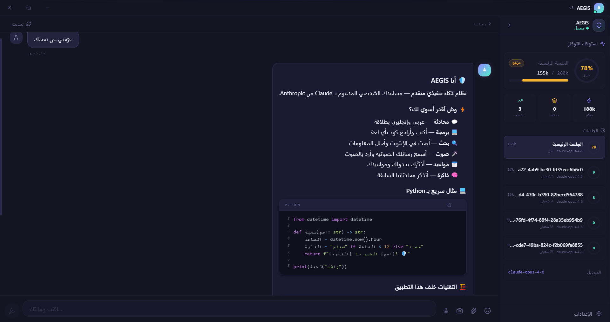
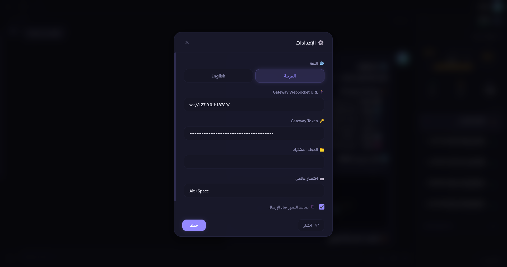

# 🛡️ AEGIS Desktop v4.0 — Mission Control

> **Advanced Executive General Intelligence System** — Your AI Command Center


A premium desktop client for [OpenClaw](https://github.com/openclaw/openclaw) — transforming your AI gateway into a full mission control center with 8 dedicated pages, real-time monitoring, and multi-agent management.

---

## 📸 Screenshots

| Dashboard | Chat |
|:---------:|:----:|
|  |  |

| Agent Hub | Cron Monitor |
|:---------:|:------------:|
|  |  |

| Workshop (Kanban) | Cost Tracker |
|:-----------------:|:------------:|
|  |  |

| Memory Explorer | Settings |
|:---------------:|:--------:|
|  |  |

---

## ✨ Features

### 🏠 Dashboard — Mission Control
- At-a-glance overview: connection status, token usage, active sessions, recent activity
- Quick Actions — trigger heartbeat, check email, view calendar
- Mini info cards in the sidebar — always visible

### 💬 Chat
- **Multi-tab sessions** — open multiple chats with `Ctrl+Tab` switching
- **Streaming responses** with real-time markdown rendering
- **Image support** — paste, drag & drop, or upload images
- **Emoji Picker** with search and categories
- **Voice playback** — TTS audio via Edge TTS (Arabic Fusha)
- **Floating Chat Widget** (Intercom-style) — available on every page
- **Compaction Divider** — visual separator when context is compressed
- **Message Queue** — messages buffer during disconnect and auto-send on reconnect

### 🤖 Agent Hub
- **Main Agent** hero card with live status
- **Registered Agents** grid — view all configured agents
- **Agent CRUD** — create, edit, and delete agents directly from the UI
- **Active Workers** — monitor isolated sessions (cron jobs, sub-agents)
- **Smart Classification** — 10 worker types with auto-detected icons and colors

### ⏰ Cron Monitor
- **Job Dashboard** — view all scheduled jobs with status, schedule, and controls
- **Run / Pause / Resume** — manage jobs with one click
- **Run History** — expandable view showing last 10 runs per job with status and duration
- **Human-readable schedules** — "Every 6 hours", "Daily at 9 PM Riyadh"
- **Templates** — 4 ready-made templates (Morning Briefing, Weekly Digest, Check-In, System Health)

### 📋 Workshop (Kanban)
- **Drag & Drop** task board with customizable columns
- **Task cards** with priority, labels, and descriptions
- Demo tasks included to get started

### 💰 Cost Tracker
- **Usage charts** with daily/weekly/monthly views (Recharts)
- **Budget Alerts** — get notified when approaching limits
- **Export** — CSV download or copy to clipboard

### 🧠 Memory Explorer
- **Browse memories** with auto-loading and search
- **Color-coded categories** — visual bars by memory type
- **CRUD operations** — create, view, and manage memories

### 🔔 Notification Center
- **Bell badge** with unread count
- **Notification history** panel
- **Chime sound** + Do Not Disturb mode

### ⌨️ Keyboard Shortcuts

| Shortcut | Action |
|----------|--------|
| `Ctrl+K` | Command Palette — search & execute |
| `Ctrl+1` – `Ctrl+8` | Navigate to page |
| `Ctrl+,` | Open Settings |
| `Ctrl+Tab` | Switch between chat tabs |
| `Ctrl+W` | Close current tab |
| `Ctrl+N` | Go to Chat |
| `Ctrl+R` | Refresh |
| `Alt+Space` | Show/hide window (global) |

### 🌐 Multi-Language
- **Arabic (العربية)** — full RTL layout, sidebar on the right
- **English** — full LTR layout, sidebar on the left
- Switch anytime from Settings or during installation

### 🎨 Design
- **Liquid Glass Dark** theme with Electric Blue accents
- **Glass Pill** window controls (custom title bar)
- **Framer Motion** animations throughout
- **Splash Screen** on startup

### 🔌 Connection
- **Auto-reconnect** with exponential backoff (up to 10 attempts)
- **Activity-based heartbeat** — detects dead connections within 45 seconds
- **Offline message queue** — buffers up to 50 messages, auto-flushes on reconnect
- **Token usage bar** in sidebar — always visible

---

## 📦 Installation

1. Download `AEGIS-Desktop-Setup-4.0.0.exe` from [Releases](../../releases)
2. Run the installer — choose your language (Arabic / English)
3. Make sure [OpenClaw](https://github.com/openclaw/openclaw) Gateway is running

### Portable

Download `AEGIS-Desktop-4.0.0.exe` — runs without installation.

### Requirements

- Windows 10/11
- [OpenClaw](https://github.com/openclaw/openclaw) v2026.2.9 or later
- OpenClaw Gateway running locally or remotely

---

## 🛠️ Development

```bash
npm install
npm run dev            # Vite + Electron (hot reload)
npm run dev:web        # Vite only (browser, no Electron)
npm run build          # Production build
npm run package        # NSIS Installer
npm run package:portable  # Portable exe
```

---

## 🔧 Tech Stack

| Layer | Technology |
|-------|-----------|
| Framework | Electron 34 |
| UI | React 18 + TypeScript 5.7 |
| Build | Vite 6 |
| Styling | TailwindCSS + Framer Motion |
| State | Zustand |
| Charts | Recharts |
| i18n | react-i18next |
| Routing | react-router-dom |
| Icons | Lucide React |

---

## 👤 Author

**Rashed** — © 2026
